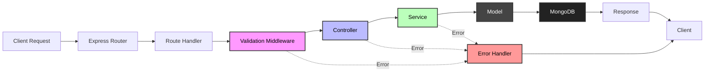

# Project Structure

This guide explains the architecture, folder structure, and design patterns used in your scaffolded backend project.

## Overview

Create Backend App scaffolds a **production-ready MVC architecture** with a **service layer** for business logic. This pattern ensures:

- **Separation of concerns** - Each layer has a single responsibility
- **Testability** - Business logic is isolated in services
- **Scalability** - Easy to add new features without breaking existing code
- **Maintainability** - Clear organization makes code easy to navigate

## Folder Structure

```
my-backend-app/
├── src/
│   ├── app.ts                 # Express app configuration
│   ├── server.ts              # Server entry point & startup logic
│   ├── config/                # Configuration files
│   │   ├── config.ts          # Environment variables & app config
│   │   └── database.ts        # Database connection setup
│   ├── constants/             # Constants files
│   │   ├── http.ts            # HTTP status codes
│   │   └── messages.ts        # All application wise messages
│   ├── controllers/           # Request handlers
│   │   └── user.controller.ts # User-related endpoints logic
│   ├── middleware/            # Express middleware
│   │   ├── errorHandler.ts   # Global error handling middleware
│   │   └── validate.ts        # Request validation middleware
│   ├── models/                # Database models
│   │   └── User.model.ts      # User schema & model (Mongoose)
│   ├── routes/                # API route definitions
│   │   ├── index.ts           # Route exports
│   │   └── user.routes.ts     # User routes
│   ├── services/              # Business logic layer
│   │   ├── base.service.ts    # Base service class
│   │   ├── index.ts           # Service exports
│   │   └── user.service.ts    # User business logic
│   ├── utils/                 # Utility functions
│   │   ├── asyncHandler.ts    # Async error wrapper
│   │   └── logger.ts          # Pino logger setup
│   └── validation/            # Zod validation schemas
│       ├── index.ts           # Validation exports
│       └── user.validation.ts # User validation schemas
├── dist/                      # Compiled JavaScript (after build)
├── .env                       # Environment variables (gitignored)
├── .env.example               # Example environment variables
├── .eslintrc.json             # ESLint configuration
├── .gitignore                 # Git ignore rules
├── package.json               # Project dependencies
├── README.md                  # Project documentation
└── tsconfig.json              # TypeScript configuration
```

## Folder Explanations

### `config/`
Contains all configuration files for the application.

- **`config.ts`** - Centralizes environment variables and app configuration
  - Loads and validates environment variables
  - Exports typed configuration object
  - Single source of truth for config

- **`database.ts`** - Database connection logic
  - Handles MongoDB connection with Mongoose
  - Includes connection error handling
  - Provides connection status logging

### `controllers/`
Handle HTTP requests and responses. Controllers are the **thin layer** between routes and services.

**Responsibilities:**
- Extract data from request (body, params, query)
- Call service methods
- Format and send responses
- Handle HTTP-specific logic (status codes, headers)

**What controllers should NOT do:**
- ❌ Business logic
- ❌ Database queries
- ❌ Complex data manipulation

**Example:**
```typescript
export const getUsers = asyncHandler(async (req, res) => {
  const users = await userService.findAll();
  res.json({ success: true, data: users });
});
```

### `middleware/`
Express middleware functions for cross-cutting concerns.

- **`errorHandler.ts`** - Global error handling
  - Catches all errors from async routes
  - Formats error responses consistently
  - Logs errors with appropriate severity

- **`validate.ts`** - Request validation middleware
  - Validates request body, params, query, headers
  - Uses Zod schemas for type-safe validation
  - Returns structured validation errors

### `models/`
Mongoose schemas and models representing database collections.

**Responsibilities:**
- Define data structure and types
- Set validation rules
- Define indexes
- Add instance and static methods
- Define virtuals and hooks

**Example:**
```typescript
const userSchema = new mongoose.Schema({
  name: { type: String, required: true },
  email: { type: String, required: true, unique: true }
}, { timestamps: true });

export const User = mongoose.model('User', userSchema);
```

### `routes/`
API route definitions that map URLs to controller functions.

**Responsibilities:**
- Define HTTP methods and paths
- Apply middleware (validation, authentication)
- Map routes to controller functions

**Example:**
```typescript
router.get('/', getUsers);
router.post('/', validate({ body: createUserSchema }), createUser);
router.get('/:id', validate({ params: idParamSchema }), getUser);
```

### `services/`
Business logic layer - the **heart of your application**.

**Responsibilities:**
- Business logic and rules
- Database operations (CRUD)
- Data transformation
- Validation of business rules
- Interaction with external APIs

**Why use services?**
- ✅ Reusable across different controllers
- ✅ Easily testable (no HTTP dependencies)
- ✅ Centralized business logic
- ✅ Cleaner controllers

**Example:**
```typescript
export class UserService extends BaseService {
  async findByEmail(email: string) {
    return await User.findOne({ email });
  }

  async createUser(data: CreateUserDto) {
    // Business logic here
    if (await this.findByEmail(data.email)) {
      throw new Error('Email already exists');
    }
    return await User.create(data);
  }
}
```

### `utils/`
Helper functions and utilities used across the application.

- **`asyncHandler.ts`** - Wraps async route handlers
  - Catches errors in async functions
  - Passes errors to error handling middleware
  - Eliminates try/catch boilerplate

- **`logger.ts`** - Pino logger configuration
  - Pretty printing in development
  - JSON logs in production
  - Configurable log levels

### `validation/`
Zod schemas for request validation and type safety.

**Responsibilities:**
- Define request validation schemas
- Provide type inference for TypeScript
- Reusable validation logic

**Example:**
```typescript
export const createUserSchema = z.object({
  name: z.string().min(1).max(100),
  email: z.string().email()
});

export type CreateUserDto = z.infer<typeof createUserSchema>;
```

## Request Flow

Understanding how a request flows through the application:



### Step-by-Step Flow

1. **Client Request** - HTTP request arrives at Express
2. **Router** - Matches request to a route in `routes/`
3. **Middleware** - Request passes through validation middleware
   - Validates body/params/query using Zod schemas
   - Stops and returns 400 error if validation fails
4. **Controller** - Extracts data and calls service method
5. **Service** - Executes business logic and database operations
6. **Model** - Interacts with MongoDB via Mongoose
7. **Response** - Data flows back through service → controller → client
8. **Error Handler** - Any errors are caught and formatted consistently

## Architecture Patterns

### MVC with Service Layer

```
┌─────────────┐
│   Routes    │  ← Define URL endpoints
└──────┬──────┘
       │
┌──────▼──────┐
│ Controllers │  ← Handle HTTP (thin layer)
└──────┬──────┘
       │
┌──────▼──────┐
│  Services   │  ← Business logic (thick layer)
└──────┬──────┘
       │
┌──────▼──────┐
│   Models    │  ← Data layer (Mongoose)
└─────────────┘
```

### Dependency Flow

- **Routes** depend on **Controllers** and **Middleware**
- **Controllers** depend on **Services**
- **Services** depend on **Models**
- **Models** are independent (only Mongoose dependency)

**Benefits:**
- Clear dependency hierarchy
- Easy to test each layer in isolation
- Changes in one layer don't affect others

## File Naming Conventions

The scaffolded project uses consistent naming:

| Type | Convention | Example |
|------|------------|---------|
| **Controllers** | `{entity}.controller.ts` | `user.controller.ts` |
| **Services** | `{entity}.service.ts` | `user.service.ts` |
| **Models** | `{Entity}.model.ts` | `User.model.ts` |
| **Routes** | `{entity}.routes.ts` | `user.routes.ts` |
| **Validation** | `{entity}.validation.ts` | `user.validation.ts` |
| **Middleware** | `{purpose}.ts` | `errorHandler.ts` |
| **Utils** | `{purpose}.ts` | `asyncHandler.ts` |

 Don't waste time on naming conventions choose one and follow.
 Someone can like kebab case like `user-controller.ts` and someone can like `userController.ts`.
 But in the end naming doesn't matter. What matters is your logic is clean and easy to understand.
 
## Best Practices

### Controllers
- Keep them thin - delegate to services
- Handle HTTP concerns only (status codes, headers)
- Don't put business logic here

### Services
- Keep them thick - this is where logic lives
- Make methods reusable
- Return domain objects, not HTTP responses
- Throw errors, let middleware handle them

### Models
- Define schema validations
- Add indexes for frequently queried fields
- Use TypeScript interfaces for type safety
- Keep model logic isolated

### Validation
- Validate at the route level (middleware)
- Use Zod for type-safe schemas
- Don't duplicate validation in services

## TypeScript Configuration

The `tsconfig.json` is configured for modern TypeScript:

```json
{
  "compilerOptions": {
    "target": "ES2022",
    "module": "commonjs",
    "outDir": "./dist",
    "rootDir": "./src",
    "strict": true,
    "esModuleInterop": true,
    "skipLibCheck": true,
    "forceConsistentCasingInFileNames": true
  }
}
```

**Key settings:**
- **strict: true** - Enables all strict type checking
- **esModuleInterop: true** - Better ES module compatibility
- **outDir: ./dist** - Compiled JS goes to `dist/`

## Environment Variables

The `.env.example` shows all required environment variables:

```env
# Server
PORT=3000
NODE_ENV=development

# Database
MONGO_URI=mongodb://localhost:27017/your-db-name
```

**Best Practices:**
- ✅ Never commit `.env` to git
- ✅ Always update `.env.example` when adding new vars
- ✅ Validate env vars in `config/config.ts`
- ✅ Use typed config object from `config.ts`

## Next Steps

Now that you understand the structure:

1. **Add Your First Feature** - Follow the [Adding Features Guide](./guides/adding-features.md)
2. **Learn the API Reference** - Check out the [API Reference](./api-reference.md)
3. **Customize the Architecture** - Adapt it to your needs while maintaining patterns

---

**Previous:** [Getting Started](./getting-started.md) | **Next:** [API Reference](./api-reference.md)
